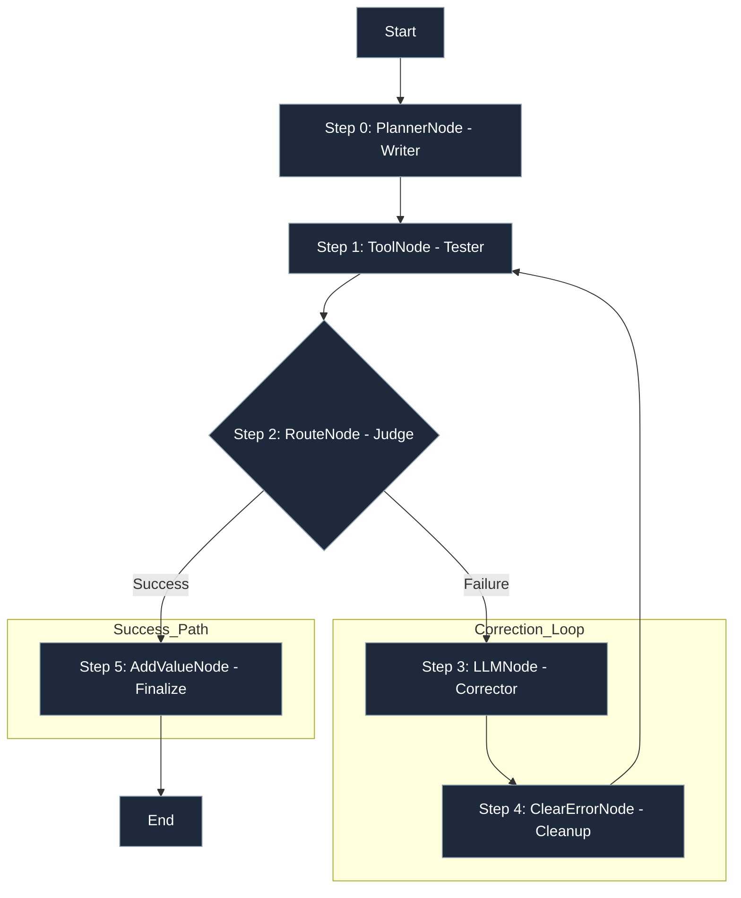
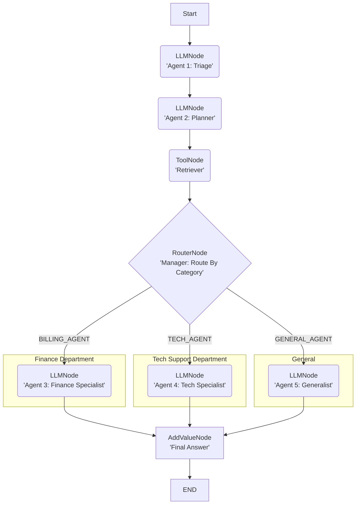

<p align="center">
  
</p>
<p align="center"><em>Lár: The Pytorch for Agents</em></p>
<p align="center">
  <a href="https://pypi.org/project/lar-engine/">
    
  </a>
  <a href="https://pypi.org/project/lar-engine/">
    
  </a>
  <a href="https://github.com/sponsors/axdithyaxo">
    
  </a>
</p>

# Lár: The PyTorch for Agents


**Lár** (Irish for "core" or "center") is the open source standard for **Deterministic, Auditable, and Air-Gap Capable** AI agents.

It is a **"define-by-run"** framework that acts as a **Flight Recorder** for your agent, creating a complete audit trail for every single step.

> [!NOTE]
> **Lár is NOT a wrapper.**
> It is a standalone, ground-up engine designed for reliability. It does not wrap LangChain, OpenAI Swarm, or any other library. It is pure, dependency-lite Python code optimized for "Code-as-Graph" execution.

## The "Black Box" Problem

You are a developer launching a **mission-critical AI agent**. It works on your machine, but in production, it fails.
You don't know **why**, **where**, or **how much** it cost. You just get a 100-line stack trace from a "magic" framework.

## The "Glass Box" Solution

**Lár removes the magic.**

It is a simple engine that runs **one node at a time**, logging every single step to a forensic **Flight Recorder**.

This means you get:
1.  **Instant Debugging**: See the exact node and error that caused the crash.
2.  **Free Auditing**: A complete history of every decision and token cost, built-in by default.
3.  **Total Control**: Build deterministic "assembly lines," not chaotic chat rooms.

> *"This demonstrates that for a graph without randomness or external model variability, Lár executes deterministically and produces identical state traces."*

*Stop guessing. Start building agents you can trust.*


## Why Lár is Better: The "Glass Box" Advantage

| Feature | The "Black Box" (LangChain / CrewAI) | The "Glass Box" (Lár) |
| :--- | :--- | :--- |
| **Debugging** | **A Nightmare.** When an agent fails, you get a 100-line stack trace from inside the framework's "magic" AgentExecutor. You have to guess what went wrong. | **Instant & Precise.** Your history log is the debugger. You see the exact node that failed (e.g., `ToolNode`), You see the exact error (`APIConnectionError`), and the exact state that caused it. |
| **Auditability** | **External & Paid.** "What happened?" is a mystery. You need an external, paid tool like LangSmith to add a "flight recorder" to your "black box." | **Built-in & Free.** The **"Flight Log"** (history log) is the core, default, open-source output of the `GraphExecutor`. You built this from day one. |
| **Multi-Agent Collaboration** | **Chaotic "Chat Room."** Agents are put in a room to "talk" to each other. It's "magic," but it's uncontrollable. You can't be sure who will talk next or if they'll get stuck in a loop. | **Deterministic "Assembly Line."** You are the architect. You define the exact path of collaboration using `RouterNode` and `ToolNode`. |
| **Deterministic Control** | **None.** You can't guarantee execution order. The "Tweeter" agent might run before the "Researcher" agent is finished. | **Full Control.** The "Tweeter" (`LLMNode`) cannot run until the "RAG Agent" (`ToolNode`) has successfully finished and saved its result to the state. |
| **Data Flow** | **Implicit & Messy.** Agents pass data by "chatting." The `ToolNode`'s output might be polluted by another agent's "thoughts." | **Explicit & Hard-Coded.** The data flow is defined by you: `RAG Output -> Tweet Input`. The "Tweeter" only sees the data it's supposed to. |
| **Resilience & Cost** | **Wasteful & Brittle.** If the RAG agent fails, the Tweeter agent might still run with no data, wasting API calls and money. A loop of 5 agents all chatting can hit rate limits fast. | **Efficient & Resilient.** If the RAG agent fails, the Tweeter never runs. Your graph stops, saving you money and preventing a bad output. Your `LLMNode`'s built-in retry handles transient errors silently. |
| **Core Philosophy** | Sells "Magic." | Sells "Trust." |

---

## Universal Model Support: Powered by LiteLLM

**Lár runs on 100+ Providers.**
Because Lár is built on the robust **[LiteLLM](https://docs.litellm.ai/docs/)** adapter, you are not locked into one vendor.

Start with **OpenAI** for prototyping. Deploy with **Azure/Bedrock** for compliance. Switch to **Ollama** for local privacy. All with **Zero Refactoring**.

| **Task** | **LangChain / CrewAI** | **Lár (The Unified Way)** |
| :--- | :--- | :--- |
| **Switching Providers** | 1. Import new provider class.<br>2. Instantiate specific object.<br>3. Refactor logic. | **Change 1 string.**<br>`model="gpt-4o"` → `model="ollama/phi4"` |
| **Code Changes** | **High.** `ChatOpenAI` vs `ChatBedrock` classes. | **Zero.** The API contract is identical for every model. |

**[Read the Full LiteLLM Setup Guide](https://docs.snath.ai/guides/litellm_setup/)** to learn how to configure:
-   **Local Models** (Ollama, Llama.cpp, LocalAI)
-   **Cloud Providers** (OpenAI, Anthropic, Vertex, Bedrock, Azure)
-   **Advanced Config** (Temperature, API Base, Custom Headers)

```python
# Want to save money? Switch to local.
# No imports to change. No logic to refactor.

# Before (Cloud)
node = LLMNode(model_name="gpt-4o", ...)

# After (Local - Ollama)
node = LLMNode(model_name="ollama/phi4", ...)

# After (Local - Generic Server)
node = LLMNode(
    model_name="openai/custom",
    generation_config={"api_base": "http://localhost:8080/v1"}
)
```

---

## Quick Start (`v1.4.0`)

**The fastest way to build an agent is the CLI.**

### 1. Install & Scaffold
```bash
pip install lar-engine
lar new agent my-bot
cd my-bot
poetry install  # or pip install -e .
python agent.py
```
> This generates a production-ready folder structure with `pyproject.toml`, `.env`, and a template agent.
> *(For Lár v1.4.0+)*

### 2. The "Low Code" Way (`@node`)
Define nodes as simple functions. No boilerplate.
```python
from lar import node

@node(output_key="summary")
def summarize_text(state):
    # Access state like a dictionary (New in v1.4.0!)
    text = state["text"] 
    return llm.generate(text)
```
*(See `examples/v1_4_showcase.py` for a full comparison)*

## The Game Changer: Hybrid Cognitive Architecture

**Most frameworks are "All LLM." This doesn't scale.**
You cannot run 1,000 agents if every step costs $0.05 and takes 3 seconds.

### 1. The "Construction Site" Metaphor

*   **The Old Way (Standard Agents):**
    Imagine a construction site where **every single worker is a high-paid Architect**. To hammer a nail, they stop, "think" about the nail, write a poem about the nail, and charge you $5. It takes forever and costs a fortune.

*   **The Lár Way (Hybrid Swarm):**
    Imagine **One Architect** and **1,000 Robots**.
    1.  **The Architect (Orchestrator Node)**: Looks at the blueprint ONCE. Yells: *"Build the Skyscraper!"*
    2.  **The Robots (Swarm)**: They hear the order. They don't "think." They don't charge $5. They just **execute** thousands of steps instantly.

### 2. The Numbers Don't Lie

We prove this in **[`examples/scale/1_corporate_swarm.py`](examples/scale/1_corporate_swarm.py)**.

| Feature | Standard "Agent Builder" (LangChain/CrewAI) | Lár "Hybrid" Architecture |
| :--- | :--- | :--- |
| **Logic** | 100% LLM Nodes. Every step is a prompt. | **1% LLM (Orchestrator) + 99% Code (Swarm)** |
| **Cost** | **$$$** (60 LLM calls). | **$** (1 LLM call). |
| **Speed** | **Slow** (60s+ latency). | **Instant** (0.08s for 64 steps). |
| **Reliability** | **Low**. "Telephone Game" effect. | **High**. Deterministic execution. |

### 3. Case Study: The "Smoking Gun" Proof
We built the generic "Corporate Swarm" in massive-scale LangChain/LangGraph (`examples/comparisons/langchain_swarm_fail.py`) to compare.
**It crashed at Step 25.**

```text
-> Step 24
CRASH CONFIRMED: Recursion limit of 25 reached without hitting a stop condition.
LangGraph Engine stopped execution due to Recursion Limit.
```

**Why this matters:**
1.  **The "Recursion Limit" Crash**: Standard executors treat agents as loops. They cap at 25 steps to prevent infinite loops. Real work (like a 60-step swarm) triggers this safety switch.
2.  **Clone the Patterns**: You don't need a framework. You need a pattern. We provide **21 single-file recipes** (Examples 1-21).
3.  **The "Token Burn"**: Standard frameworks use an LLM to route every step ($0.60/run). Lár uses code ($0.00/run).
4.  **The "Telephone Game"**: Passing data through 60 LLM layers corrupts context. Lár passes explicit state objects.

> "Lár turns Agents from 'Chatbot Prototyping' into 'High-Performance Software'."

---


### A Simple Self-Correcting Loop



---


## The `Lár` Architecture: Core Primitives

You can build any agent with four core components:

1.  **`GraphState`**: A simple, unified object that holds the "memory" of the agent. It is passed to every node, allowing one node to write data (`state.set(...)`) and the next to read it (`state.get(...)`).

2.  **`BaseNode`**: The abstract class (the "contract") for all executable units. It enforces a single method: `execute(self, state)`. The `execute` method's sole responsibility is to perform its logic and return the *next* `BaseNode` to run, or `None` to terminate the graph.

3.  **`GraphExecutor`**: The "engine" that runs the graph. It is a Python generator that runs one node, yields the execution log for that step, and then pauses, waiting for the next call.
    
    **New in v1.3.0:** Modular observability with separated concerns:
    - **`AuditLogger`**: Centralizes audit trail logging and file persistence (GxP-compliant)
    - **`TokenTracker`**: Aggregates token usage across multiple providers and models
    
    ```python
    # Default (automatic - recommended)
    executor = GraphExecutor(log_dir="my_logs")
    
    # Advanced (custom injection for cost aggregation across workflows)
    from lar import AuditLogger, TokenTracker
    custom_tracker = TokenTracker()
    executor1 = GraphExecutor(logger=AuditLogger("logs1"), tracker=custom_tracker)
    executor2 = GraphExecutor(logger=AuditLogger("logs2"), tracker=custom_tracker)
    # Both executors share the same tracker → aggregated cost tracking
    ```
    
    **See:** `examples/patterns/16_custom_logger_tracker.py` for full demo

### 4. Node Implementations (The Building Blocks)

- **`LLMNode`**: The "Thinker." Calls any major LLM API (Gemini, GPT-4, DeepSeek, etc.) to plan, reason, or write code.
- **`ToolNode`**: The "Actor." Executes deterministic Python functions (API calls, DB lookups). Separates success/error routing.
- **`RouterNode`**: The "Traffic Cop." Deterministically routes execution to the next node based on state values.
- **`BatchNode`** *(New)*: The "Parallelizer." Fans out multiple nodes to run concurrently on separate threads.
- **`ReduceNode`** *(New)*: The "Compressor." Summarizes multi-agent outputs and explicitly deletes raw memory to prevent context bloat.
- **`DynamicNode`** *(New)*: The "Architect." Can recursively generate and execute new sub-agents at runtime (Fractal Agency).
- **`HumanJuryNode`**: The "Guard." Pauses execution for explicit human approval via CLI.
- **`ClearErrorNode`**: The "Janitor." Clears error states to allow robust retry loops.

---

## Reasoning Models (System 2 Support)

**Lár treats "Thinking" as a first-class citizen.**
Native support for **DeepSeek R1**, **OpenAI o1**, and **Liquid**.

- **Audit Logic:** Distinct `<think>` tags are captured in metadata, keeping your main context window clean.
- **Robustness:** Handles malformed tags and fallback logic automatically.
- **Example:** `examples/reasoning_models/1_deepseek_r1.py`

## Why Lár?
- **Economic Constraints:** Guarantee that agents cannot exceed mathematically set Token Budgets before execution. (v1.6+)
- **Memory Compression:** explicitly delete context from state via `ReduceNode` map-reduce patterns to prevent "black hole" token bloat. (v1.6+)
- **Fractal Agency:** Agents can spawn sub-agents recursively (`DynamicNode`). (v1.5+)
- **True Parallelism:** Run multiple agents in parallel threads (`BatchNode`). (v1.5+)
- **Lightweight:** No vector DB required. Just Python.
- **Model Agnostic:** Works with OpenAI, Gemini, Claude, DeepSeek, Ollama, etc.
- **Glass Box:** Every step, prompt, and thought is logged to `lar_logs/` for audit.
- **Automatic Capture**: The "thinking process" is extracted and saved to `run_metadata`.
- **Clean Output**: Your downstream nodes only see the final answer.
- **Robustness**: Works with both API-based reasoning (o1) and local raw reasoning (DeepSeek R1 via Ollama).

```python
# examples/reasoning_models/1_deepseek_r1.py
node = LLMNode(
    model_name="ollama/deepseek-r1:7b",
    prompt_template="Solve: {puzzle}",
    output_key="answer"
)
# Result: 
# state['answer'] = "The answer is 42."
# log['metadata']['reasoning_content'] = "<think>First, I calculate...</think>"
```

---

## Example "Glass Box" Audit Trail

You don't need to guess why an agent failed. `lar` is a "glass box" that provides a complete, auditable log for every run, especially failures.

This is a **real execution** log from a lar-built agent. The agent's job was to run a "Planner" and then a "Synthesizer" (both LLMNodes). The GraphExecutor caught a fatal error, gracefully stopped the agent, and produced this perfect audit trail.

**Execution Summary (Run ID: a1b2c3d4-...)**
| Step | Node | Outcome | Key Changes |
| :--- | :--- | :--- | :--- |
| 0 | `LLMNode` | `success` | `+ ADDED: 'search_query'` |
| 1 | `ToolNode` | `success` | `+ ADDED: 'retrieved_context'` |
| 2 | `LLMNode` | `success` | `+ ADDED: 'draft_answer'` |
| 3 | `LLMNode` | **`error`** | **`+ ADDED: 'error': "APIConnectionError"`** |

**This is the `lar` difference.** You know the *exact* node (`LLMNode`), the *exact* step (3), and the *exact reason* (`APIConnectionError`) for the failure. You can't debug a "black box," but you can **always** fix a "glass box."

---

## Cryptographic Audit Logs (v1.5.1+)

For enterprise environments (EU AI Act, SOC2, HIPAA), having a log isn't enough—you must prove the log wasn't tampered with.

Lár natively supports **HMAC-SHA256 Cryptographic Signing** of your audit logs. If an agent executes a high-stakes trade or a medical diagnosis, the `GraphExecutor` will mathematically sign the entire execution trace (including nodes visited, LLM reasoning, and token usage) using a Secret Key.

```python
from lar import GraphExecutor

# 1. Instantiating the executor with an HMAC secret turns on Cryptographic Auditing
executor = GraphExecutor(
    log_dir="secure_logs", 
    hmac_secret="your_enterprise_secret_key"
)
# 2. Run your agent as normal. The resulting JSON log will contain a SHA-256 signature.

# 3. To verify the audit log later, you can use the standalone verification script:
# See: examples/compliance/11_verify_audit_log.py
```

### How to Verify (For Auditors)
We provide a standalone verification script specifically for Compliance Officers to mathematically prove a log has not been tampered with.

**Step 1:** Locate the generated JSON audit log (e.g., `secure_logs/run_xyz.json`).
**Step 2:** Obtain the enterprise HMAC Secret Key used during the agent's execution.
**Step 3:** Run the verification script from your terminal:
```bash
python examples/compliance/11_verify_audit_log.py secure_logs/run_xyz.json your_enterprise_secret_key
```

**Outcome:** The script will output either `[+] VERIFICATION SUCCESSFUL` (authentic) or `[-] VERIFICATION FAILED` (tampered).

**See the Compliance Pattern Library for full verification scripts:**
*   [`examples/compliance/8_hmac_audit_log.py`](examples/compliance/8_hmac_audit_log.py) (Basic Authentication)
*   [`examples/compliance/9_high_risk_trading_hmac.py`](examples/compliance/9_high_risk_trading_hmac.py) (Algorithmic Trading / SEC)
*   [`examples/compliance/10_pharma_clinical_trials_hmac.py`](examples/compliance/10_pharma_clinical_trials_hmac.py) (FDA 21 CFR Part 11)
*   [`examples/compliance/11_verify_audit_log.py`](examples/compliance/11_verify_audit_log.py) (Standalone Auditor Script)


##  Just-in-Time Integrations

**Stop waiting for "HubSpot Support" to merge.**

Lár does not ship with 500+ brittle API wrappers. Instead, we ship the **Integration Builder**.

1.  **Drag** [`IDE_INTEGRATION_PROMPT.md`](IDE_INTEGRATION_PROMPT.md) into your AI Chat (Cursor/Windsurf).
2.  **Ask**: *"Make me a tool that queries the Stripe API for failed payments."*
3.  **Done**: You get a production-ready, type-safe `ToolNode` in 30 seconds.

 **[Read the Full Guide](https://docs.snath.ai/guides/integrations/)** | **[See Example](examples/patterns/7_integration_test.py)**


## Metacognition (Level 4 Agency)

**New in v1.3**: Lár introduces the **Dynamic Graph**, allowing agents to rewrite their own topology at runtime.

This unlocks capabilities previously impossible in static DAGs:
- **Self-Healing**: Detects errors and injects recovery subgraphs.
- **Tool Invention**: Writes and executes its own Python tools on the fly.
- **Adaptive Depth**: Decides between "Quick Answer" (1 node) vs "Deep Research" (N nodes).
- **Custom Observability**: Inject custom logger/tracker instances for advanced cost tracking and audit trail management (`examples/patterns/16_custom_logger_tracker.py`).

> [!IMPORTANT]
> **Risk Mitigation**: Self-Modifying Code is inherently risky. Lár ensures **Compliance** by:
> 1. Logging the exact JSON of the generated graph (Audit Trail).
> 2. Using a deterministic `TopologyValidator` (Non-AI) to prevent unauthorized tools, infinite loops, or **malformed graph structures** (Structural Integrity).

See `examples/metacognition/` for 5 working Proof-of-Concepts.

---

## The DMN Showcase: A Cognitive Architecture

**[snath-ai/DMN](https://github.com/snath-ai/DMN)** - The flagship demonstration of Lár's capabilities.

DMN (Default Mode Network) is a **complete cognitive architecture** built entirely on Lár, showcasing what's possible when you combine:
- **Bicameral Mind**: Fast/Slow thinking systems running in parallel
- **Sleep Cycles**: Automatic memory consolidation during "rest" periods  
- **Episodic Memory**: Long-term storage with vectorized recall
- **Self-Awareness**: Metacognitive introspection and adaptive behavior

> [!NOTE]
> **DMN proves that Lár isn't just for chatbots.** It's a platform for building genuinely intelligent systems with memory, learning, and self-improvement capabilities.

### What Makes DMN Special?

| Feature | Traditional Agents | DMN (Built on Lár) |
|---------|-------------------|---------------------|
| **Memory** | Context window only | Persistent episodic memory with sleep consolidation |
| **Learning** | Static prompts | Learns from interactions and self-corrects |
| **Architecture** | Single-path logic | Dual-process (Fast + Slow) cognitive system |
| **Auditability** | Black box | Complete glass-box audit trail of every thought |

**[Explore the DMN Repository →](https://github.com/snath-ai/DMN)**

---


##  Installation

This project is managed with [Poetry](https://python-poetry.org/).

1.  **Clone the repository:**

    ```bash
    git clone https://github.com/snath-ai/lar.git
    cd lar
    ```

2. **Set Up Environment Variables**
Lár uses the unified LiteLLM adapter under the hood. This means if a model is supported by LiteLLM (100+ providers including Azure, Bedrock, VertexAI), it is supported by Lár.

Create a `.env` file:

```bash
# Required for running Gemini models:
GEMINI_API_KEY="YOUR_GEMINI_KEY_HERE" 
# Required for running OpenAI models (e.g., gpt-4o):
OPENAI_API_KEY="YOUR_OPENAI_KEY_HERE"
# Required for running Anthropic models (e.g., Claude):
ANTHROPIC_API_KEY="YOUR_ANTHROPIC_KEY_HERE"
```

3.  **Install dependencies:**
    This command creates a virtual environment and installs all packages from `pyproject.toml`.

    ```bash
    poetry install
    ```


---

## Ready to build with Lár? (Agentic IDEs)

Lár is designed for **Agentic IDEs** (Cursor, Windsurf, Antigravity) and strict code generation.

We provide a **3-Step Workflow** directly in the repo to make your IDE an expert Lár Architect.

### 1. The Strategy: "Reference, Don't Copy"
Instead of pasting massive prompts, simply **reference** the master files in the `lar/` directory.

### 2. The Workflow
1.  **Context (The Brain)**: In your IDE chat, reference `@lar/IDE_MASTER_PROMPT.md`. This loads the strict typing rules and "Code-as-Graph" philosophy.
2.  **Integrations (The Hands)**: Reference `@lar/IDE_INTEGRATION_PROMPT.md` to generate production-ready API wrappers in seconds.
3.  **Scaffold (The Ask)**: Open `@lar/IDE_PROMPT_TEMPLATE.md`, fill in your agent's goal, and ask the IDE to "Implement this."

**Example Prompt to Cursor/Windsurf:**
> "Using the rules in @lar/IDE_MASTER_PROMPT.md, implement the agent described in @lar/IDE_PROMPT_TEMPLATE.md."

### 2. Learn by Example

We have provided **21 robust patterns** in the **[`examples/`](examples/)** directory, organized by category:

> **[View the Visual Library](https://snath.ai/examples)**: Browse all patterns with diagrams and use-cases on our website.

#### 1. Basic Primitives (`examples/basic/`)
| # | Pattern | Concept |
| :---: | :--- | :--- |
| **1** | **[`1_simple_triage.py`](examples/basic/1_simple_triage.py)** | Classification & Linear Routing |
| **2** | **[`2_reward_code_agent.py`](examples/basic/2_reward_code_agent.py)** | Code-First Agent Logic |
| **3** | **[`3_support_helper_agent.py`](examples/basic/3_support_helper_agent.py)** | Lightweight Tool Assistant |
| **4** | **[`4_fastapi_server.py`](examples/basic/4_fastapi_server.py)** | FastAPI Wrapper (Deploy Anywhere) |

#### 2. Core Patterns (`examples/patterns/`)
| # | Pattern | Concept |
| :---: | :--- | :--- |
| **1** | **[`1_rag_researcher.py`](examples/patterns/1_rag_researcher.py)** | RAG (ToolNode) & State Merging |
| **2** | **[`2_self_correction.py`](examples/patterns/2_self_correction.py)** | "Judge" Pattern & Error Loops |
| **3** | **[`3_parallel_execution.py`](examples/patterns/3_parallel_execution.py)** | Fan-Out / Fan-In Aggregation |
| **4** | **[`4_structured_output.py`](examples/patterns/4_structured_output.py)** | Strict JSON Enforcement |
| **5** | **[`5_multi_agent_handoff.py`](examples/patterns/5_multi_agent_handoff.py)** | Multi-Agent Collaboration |
| **6** | **[`6_meta_prompt_optimizer.py`](examples/patterns/6_meta_prompt_optimizer.py)** | Self-Modifying Agents (Meta-Reasoning) |
| **7** | **[`7_integration_test.py`](examples/patterns/7_integration_test.py)** | Integration Builder (CoinCap) |
| **8** | **[`8_ab_tester.py`](examples/patterns/8_ab_tester.py)** | A/B Tester (Parallel Prompts) |
| **9** | **[`9_resumable_graph.py`](examples/patterns/9_resumable_graph.py)** | Time Traveller (Crash & Resume) |

#### 3. Compliance & Safety (`examples/compliance/`)
| # | Pattern | Concept |
| :---: | :--- | :--- |
| **1** | **[`1_human_in_the_loop.py`](examples/compliance/1_human_in_the_loop.py)** | User Approval & Interrupts |
| **2** | **[`2_security_firewall.py`](examples/compliance/2_security_firewall.py)** | Blocking Jailbreaks with Code |
| **3** | **[`3_juried_layer.py`](examples/compliance/3_juried_layer.py)** | Proposer -> Jury -> Kernel |
| **4** | **[`4_access_control_agent.py`](examples/compliance/4_access_control_agent.py)** | **Flagship Access Control** |
| **5** | **[`5_context_contamination_test.py`](examples/compliance/5_context_contamination_test.py)** | Red Teaming: Social Engineering |
| **6** | **[`6_zombie_action_test.py`](examples/compliance/6_zombie_action_test.py)** | Red Teaming: Stale Authority |
| **7** | **[`7_hitl_agent.py`](examples/compliance/7_hitl_agent.py)** | Article 14 Compliance Node |

#### 4. High Scale (`examples/scale/`)
| # | Pattern | Concept |
| :---: | :--- | :--- |
| **1** | **[`1_corporate_swarm.py`](examples/scale/1_corporate_swarm.py)** | **Stress Test**: 60+ Node Graph |
| **2** | **[`2_mini_swarm_pruner.py`](examples/scale/2_mini_swarm_pruner.py)** | Dynamic Graph Pruning |
| **3** | **[`3_parallel_newsroom.py`](examples/scale/3_parallel_newsroom.py)** | True Parallelism (`BatchNode`) |
| **4** | **[`4_parallel_corporate_swarm.py`](examples/scale/4_parallel_corporate_swarm.py)** | Concurrent Branch Execution |
| **5** | **[`11_map_reduce_budget.py`](examples/advanced/11_map_reduce_budget.py)** | **Memory Compression & Token Budgets** |

#### 5. Metacognition (`examples/metacognition/`)

See the **[Metacognition Docs](https://docs.snath.ai/core-concepts/9-metacognition)** for a deep dive.

| # | Pattern | Concept |
| :---: | :--- | :--- |
| **1** | **[`1_dynamic_depth.py`](examples/metacognition/1_dynamic_depth.py)** | **Adaptive Complexity** (1 Node vs N Nodes) |
| **2** | **[`2_tool_inventor.py`](examples/metacognition/2_tool_inventor.py)** | **Self-Coding** (Writing Tools at Runtime) |
| **3** | **[`3_self_healing.py`](examples/metacognition/3_self_healing.py)** | **Error Recovery** (Injecting Fix Subgraphs) |
| **4** | **[`4_adaptive_deep_dive.py`](examples/metacognition/4_adaptive_deep_dive.py)** | **Recursive Research** (Spawning Sub-Agents) |
| **5** | **[`5_expert_summoner.py`](examples/metacognition/5_expert_summoner.py)** | **Dynamic Persona Instantiation** |

#### 6. Advanced Showcase (`examples/advanced/`)
| # | Pattern | Concept |
| :---: | :--- | :--- |
| **1** | **[`fractal_polymath.py`](examples/advanced/fractal_polymath.py)** | **Fractal Agency** (Recursion + Parallelism) |


---


## Example: Multi-Agent Orchestration (A Customer Support Agent)

The *real* power of `lar` is not just loops, but **multi-agent orchestration.**

Other frameworks use a "chaotic chat room" model, where agents *talk* to each other and you *hope* for a good result. `lar` is a deterministic **"assembly line."** You are the architect. You build a "glass box" graph that routes a task to specialized agents, guaranteeing order and auditing every step.

### 1. The "Glass Box" Flowchart

This is the simple, powerful "Customer Support" agent we'll build. It's a "Master Agent" that routes tasks to specialists.



## Lár Engine Architecture: The Multi-Agent Assembly Line

### The core of this application is a Multi-Agent Orchestration Graph. `Lár` forces you to define the assembly line, which guarantees predictable, auditable results.

## Compliance & Safety (EU AI Act Ready - Aug 2026)

Lár is engineered for **High-Risk AI Systems** under the **EU AI Act (2026)** and **FDA 21 CFR Part 11**.

| Regulation | Requirement | Lár Implementation |
| :--- | :--- | :--- |
| **EU AI Act Art. 12** | **Record-Keeping** | **State-Diff Ledger**: Automatically creates an immutable, forensic JSON log of every step, variable change, and model decision. |
| **EU AI Act Art. 13** | **Transparency** | **"Glass Box" Architecture**: No hidden prompts or "magic" loops. Every node is explicit code that can be audited by non-technical reviewers. |
| **EU AI Act Art. 14** | **Human Oversight** | **Interrupt Pattern**: Native support for "Human-in-the-Loop". Pause execution, modify state, and resume—ensuring human control over high-stakes decisions. |
| **FDA 21 CFR Part 11** | **Audit Trails** | **Cryptographic Determinism**: The engine is deterministic by design, ensuring reproducible runs for clinical validation. |

---

## Quick Start
### 1. Graph Flow (Execution Sequence)

The agent executes in a fixed, 6-step sequence. The graph is `defined backwards` in the code, but the execution runs forwards:

| Step        | Node Name         | Lár Primitive | Action                                                                                   | State Output       |
|-------------|-------------------|---------------|-------------------------------------------------------------------------------------------|--------------------|
| 0 (Start)   | triage_node       | LLMNode       | Classifies the user's input (`{task}`) into a service category (BILLING, TECH, etc.).     | category           |
| 1           | planner_node      | LLMNode       | Converts the task into a concise, high-quality search query.                              | search_query       |
| 2           | retrieve_node     | ToolNode      | Executes the local FAISS vector search and retrieves the relevant context.                | retrieved_context  |
| 3           | specialist_router | RouterNode    | Decision point. Reads the category and routes the flow to the appropriate specialist.     | (No change; routing) |
| 4           | billing/tech_agent| LLMNode       | The chosen specialist synthesizes the final answer using the retrieved context.           | agent_answer       |
| 5 (End)     | final_node        | AddValueNode  | Saves the synthesized answer as `final_response` and terminates the graph.                | final_response     |

### 2. Architectural Primitives Used

This demo relies on the core Lár primitives to function:

- `LLMNode`: Used 5 times (Triage, Plan, and the 3 Specialists) for all reasoning and synthesis steps.

- `RouterNode`: Used once (specialist_router) for the deterministic if/else branching logic.

- `ToolNode`: Used once (retrieve_node) to securely execute the local RAG database lookup.

- `GraphExecutor`: The engine that runs this entire sequence and produces the complete audit log

### This is the full logic from `support_app.py`. It's just a clean, explicit Python script.

```python 
'''
====================================================================
    ARCHITECTURE NOTE: Defining the Graph Backwards
    
    The Lár Engine uses a "define-by-run" philosophy. Because a node 
    references the *next_node* object (e.g., next_node=planner_node),
    the nodes MUST be defined in Python in the REVERSE order of execution 
    to ensure the next object already exists in memory.
    
    Execution runs: START (Triage) -> END (Final)
    Definition runs: END (Final) -> START (Triage)
====================================================================

'''
from lar import *
from lar.utils import compute_state_diff # (Used by executor)

# 1. Define the "choice" logic for our Router
def triage_router_function(state: GraphState) -> str:
    """Reads the 'category' from the state and returns a route key."""
    category = state.get("category", "GENERAL").strip().upper()
    
    if "BILLING" in category:
        return "BILLING_AGENT"
    elif "TECH_SUPPORT" in category:
        return "TECH_AGENT"
    else:
        return "GENERAL_AGENT"

# 2. Define the agent's nodes (the "bricks")
# We build from the end to the start.

# --- The End Nodes (the destinations) ---
final_node = AddValueNode(key="final_response", value="{agent_answer}", next_node=None)
critical_fail_node = AddValueNode(key="final_status", value="CRITICAL_FAILURE", next_node=None)

# --- The "Specialist" Agents ---
billing_agent = LLMNode(
    model_name="gemini-1.5-pro",
    prompt_template="You are a BILLING expert. Answer '{task}' using ONLY this context: {retrieved_context}",
    output_key="agent_answer",
    next_node=final_node
)
tech_agent = LLMNode(
    model_name="gemini-1.5-pro",
    prompt_template="You are a TECH SUPPORT expert. Answer '{task}' using ONLY this context: {retrieved_context}",
    output_key="agent_answer",
    next_node=final_node
)
general_agent = LLMNode(
    model_name="gemini-1.5-pro",
    prompt_template="You are a GENERAL assistant. Answer '{task}' using ONLY this context: {retrieved_context}",
    output_key="agent_answer",
    next_node=final_node
)
    
# --- The "Manager" (Router) ---
specialist_router = RouterNode(
    decision_function=triage_router_function,
    path_map={
        "BILLING_AGENT": billing_agent,
        "TECH_AGENT": tech_agent,
        "GENERAL_AGENT": general_agent
    },
    default_node=general_agent
)
    
# --- The "Retriever" (Tool) ---
retrieve_node = ToolNode(
    tool_function=retrieve_relevant_chunks, # This is our local FAISS search
    input_keys=["search_query"],
    output_key="retrieved_context",
    next_node=specialist_router, 
    error_node=critical_fail_node
)
    
# --- The "Planner" (LLM) ---
planner_node = LLMNode(
    model_name="gemini-1.5-pro",
    prompt_template="You are a search query machine. Convert this task to a search query: {task}. Respond with ONLY the query.",
    output_key="search_query",
    next_node=retrieve_node
)
    
# --- The "Triage" Node (The *real* start) ---
triage_node = LLMNode(
    model_name="gemini-1.5-pro",
    prompt_template="You are a triage bot. Classify this task: \"{task}\". Respond ONLY with: BILLING, TECH_SUPPORT, or GENERAL.",
    output_key="category",
    next_node=planner_node
)

# 3. Run the Agent
executor = GraphExecutor()
initial_state = {"task": "How do I reset my password?"}
result_log = list(executor.run_step_by_step(
    start_node=triage_node, 
    initial_state=initial_state
))

# 4. The "Deploy Anywhere" Feature
# Serialize your entire graph logic to a portable JSON schema.
# This file can be versioned in git or imported into Snath Cloud.
executor.save_to_file("support_agent_v1.json")
print("Agent serialized successfully. Ready for deployment.")
'''
 The "glass box" log for Step 0 will show:
 "state_diff": {"added": {"category": "TECH_SUPPORT"}}

 The log for Step 1 will show:
 "Routing to LLMNode" (the tech_support_agent)
 '''
```
-----

## Ready to Build a Real Agent?
We have built two "killer demos" that prove this "glass box" model. You can clone, build, and run them today.

- **[snath-ai/DMN](https://github.com/snath-ai/DMN)**: **The Flagship Showcase.** A cognitive architecture with a "Bicameral Mind" (Fast/Slow) that sleeps, dreams, and consolidates long-term memory to solve catastrophic forgetting.

- **[`examples/compliance/4_access_control_agent.py`](examples/compliance/4_access_control_agent.py)**: **The Enterprise Flagship.** A "Juried Layer" demo that combines LLM Reasoning, Deterministic Policy, and Human-in-the-Loop Interrupts for secure infrastructure access.

- **[snath-ai/rag-demo](https://github.com/snath-ai/rag-demo)**: A complete, self-correcting RAG agent that uses a local vector database.

- **[snath-ai/customer-support-demo](https://github.com/snath-ai/customer-support-demo)**: The Customer Support agent described above.

- **[snath-ai/code-repair-demo](https://github.com/snath-ai/code-repair-demo)**: A Self-Healing CI/CD agent that writes tests, detects failures, and patches its own code in a loop.


###  Show Your Agents are Auditable

- If you build an agent using the Lár Engine, you are building a **dependable, verifiable system**. Help us spread the philosophy of the **"Glass Box"** by displaying the badge below in your project's README.

- By adopting this badge, you signal to users and collaborators that your agent is built for **production reliability and auditability.**

**Show an Auditable Badge to your project:**
[](https://docs.snath.ai)


**Badge Markdown:**

```markdown
[](https://docs.snath.ai)
```


## Ready for Production?

Lár is designed to be deployed as a standard Python library.
Read our **[Deployment Guide](https://docs.snath.ai/guides/deployment/)** to learn how to wrap your graph in **FastAPI** and deploy to AWS/Heroku.

## Author
**Lár** was created by **[Aadithya Vishnu Sajeev](https://github.com/axdithyaxo)**.

## Support the Project

Lár is an open-source agent framework built to be clear, debuggable, and developer-friendly.
If this project helps you, consider supporting its development through GitHub Sponsors.

Become a sponsor → [Sponsor on GitHub](https://github.com/sponsors/axdithyaxo)

Your support helps me continue improving the framework and building new tools for the community.

## Contributing

We welcome contributions to **`Lár`**.

To get started, please read our **[Contribution Guidelines](CONTRIBUTING.md)** on how to report bugs, submit pull requests, and propose new features.

## License

**`Làr`** is licensed under the `Apache License 2.0`

This means:

- You are free to use Làr in personal, academic, or commercial projects.
- You may modify and distribute the code.
- You MUST retain the `LICENSE` and the `NOTICE` file.
- If you distribute a modified version, you must document what you changed.

`Apache 2.0` protects the original author `(Aadithya Vishnu Sajeev)` while encouraging broad adoption and community collaboration.

For developers building on Làr:
Please ensure that the `LICENSE` and `NOTICE` files remain intact
to preserve full legal compatibility with the `Apache 2.0` terms.
