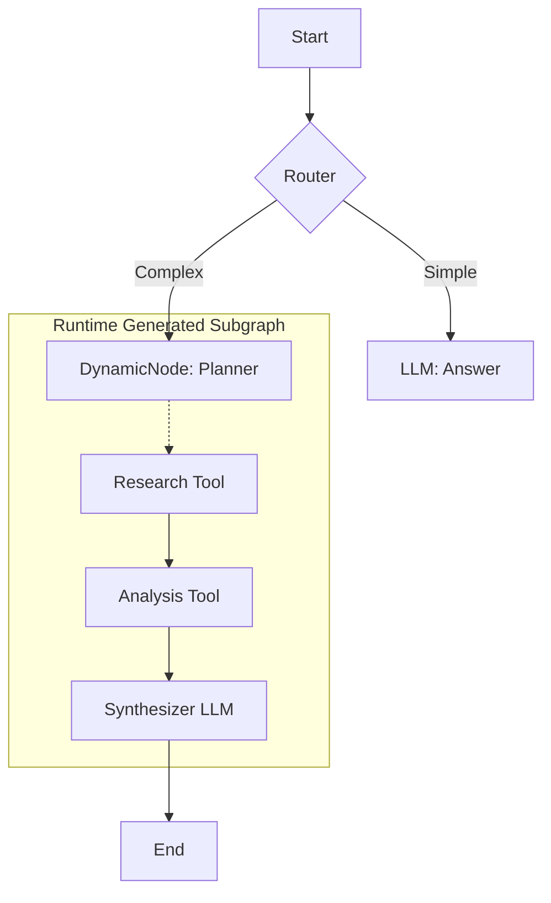

# 9. Metacognition (Dynamic Graphs)

!!! note
    **Exclusive Feature:** This capability requires Lár v1.1+. It unlocks "Level 4 Agency" (Pro-active/Self-modifying).

Metacognition is the ability of an agent to **introspect** about its own thinking process and **modify** its execution structure at runtime.

Traditional agents follow a static graph (`A -> B -> C`).
Lár Metacognition allows an agent to say: *"This task is too hard for my current graph. I need to spawn a research team, then come back to C."*

This is achieved via two new primitives: `DynamicNode` and `TopologyValidator`.

---

## The Dynamic Node Primitive

The `DynamicNode` is a unique node that **does not return text**. Instead, it returns a **Graph Spec** (a JSON blueprint for a new subgraph).

The Lár Kernel detects this spec, pauses execution, and performs a "Hot Swap":
1.  **Validate**: Checks the new subgraph against safety rules.
2.  **Instantiate**: Creates the new nodes in memory.
3.  **Link**: Wires the new subgraph's exit to the original `next_node`.
4.  **Resume**: Executes the new subgraph immediately.

### Anatomy of a Hot Swap



---

## Safety: The Topology Validator

Allowing an AI to rewrite its own code is dangerous. That's why Lár wraps every `DynamicNode` with a **Topology Validator**.

This is a deterministic, code-based security layer that enforces:
- **Cycle Detection**: Prevents infinite loops (`A -> B -> A`).
- **Tool Allowlist**: Ensures the generated graph ONLY functions from a pre-approved list.
- **Depth Limit**: Prevents "recursion bombs".

If the validator rejects a graph, the agent is forced to fall back to a safe path.

---

## 5 Metacognitive Patterns

Dynamic Graphs unlock powerful new capabilities.

### 1. Dynamic Depth (Adaptive Compute)
*Using `examples/metacognition/1_dynamic_depth.py`*

The agent decides how much "brain power" to spend.
- **User**: "Hi." -> **Agent**: Spawns 1 node (Cheap).
- **User**: "Analyze Q4 report." -> **Agent**: Spawns 5 parallel research nodes (Deep).

### 2. The Tool Inventor (Self-Programming)
*Using `examples/metacognition/2_tool_inventor.py`*

The agent encounters a problem it has no tool for (e.g., "Calculate the 100th Fibonacci number").
- **Introspection**: "I have no calculator tool."
- **Action**: It writes a Python script, verifies it, and *executes it* in a sandbox.
- **Result**: It creates its own tools on the fly.

### 3. Self-Healing Pipeline
*Using `examples/metacognition/3_self_healing.py`*

The agent encounters a runtime error (e.g., `DB Connection Failed`).
- **Standard Agent**: Crashes.
- **Metacognitive Agent**: Intercepts the error, spawns a "Doctor" subgraph (`Check Creds -> Rotate Password -> Retry`), fixes the environment, and resumes.

### 4. Adaptive Deep Dive
*Using `examples/metacognition/4_adaptive_deep_dive.py`*

The agent changes its *entire workflow* based on the query. It doesn't just route; it *architects*.
- **Fact**: Builds a `Search -> Answer` chain.
- **Opinion**: Builds a `Debate -> Synthesize` chain.

### 5. The Expert Summoner (Modular Agency)
*Using `examples/metacognition/5_expert_summoner.py`*

The agent loads pre-trained "Skills" or "Sub-Agents" from disk.
- **Context**: "I need legal advice."
- **Action**: Loads `legal_expert.json` (a serialized graph) and injects it into the current flow.

---

## How to use it

```python
from lar import DynamicNode, TopologyValidator

# 1. Define Safety Rules
validator = TopologyValidator(allowed_tools=[my_safe_tool])

# 2. Define the Metacognitive Node
planner = DynamicNode(
    llm_model="ollama/phi4",
    prompt_template="You are an architect. Output a JSON graph spec...",
    validator=validator,
    next_node=final_node
)
```

---

## Compliance & Auditing

!!! note
    **The question arises: "Does self-modifying code violate strict compliance?"**

    In a black box system, **YES**.
    In Lár, **NO**.

### Why it is compliant:
1.  **Audited Change**: The modification itself is an event. The *exact JSON spec* generated by the DynamicNode is logged in the Flight Recorder. You can replay the "decision to change".
2.  **Deterministic Validation**: The `TopologyValidator` is not AI. It is Python code. It enforces invariants (Cycle, Allowlist) deterministically. If the AI proposes a non-compliant graph, it is **rejected with an error trace**.
3.  **No Hidden State**: The new subgraph lives in the same `GraphState` as the old one. No variables are "laundered" through hidden layers.

This transforms "Jailbreak Risk" into "Managed Adaptation".
